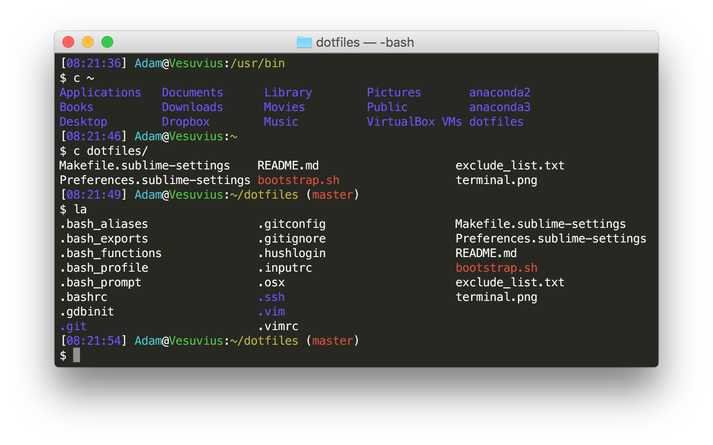

# dotfiles

:wrench: My personal Linux and macOS configurations and settings

## Screenshots

### Terminal



The bash prompt displays the time, username, hostname, and working directory. If you are in a Git or Subversion repository, it will also display the current branch and status.

### Vim


I chose a color scheme called Monokai, originally written by Wimer Hazenberg for [TextMate](https://macromates.com/), and [ported to Vim](https://github.com/sickill/vim-monokai) by [Marcin Kulik](http://ku1ik.com/). It is also the default color scheme in [Sublime Text](https://www.sublimetext.com/).

## Installation

:warning: **Warning:** Installing my dotfiles will overwrite your old dotfiles. If you have any dotfiles in your home directory, back them up before doing anything else. That way you can revert to your old settings if you want to.

### Using Git and the bootstrap script

You can clone the repository wherever you want by running:

```console
$ git clone https://github.com/adamjstewart/dotfiles.git
```

Then, all you have to do is source the bootstrap script:

```console
$ source dotfiles/bootstrap.sh
```

To update your local repository with any changes I've made, just source the bootstrap script again.

### Installing the Terminal profile on macOS

To install the Monokai Terminal profile, go to the Terminal Preferences and click on the Profiles tab. Click the settings gear at the bottom of the profile list and hit Import. Then, navigate to the `Monokai.terminal` file in your cloned repository. Click Default at the bottom of the profile list to set this as your default profile when launching a new terminal.

## Credits

* [Mathias Bynens](https://mathiasbynens.be) and his [dotfiles repository](https://github.com/mathiasbynens/dotfiles)
* [Marcin Kulik](http://ku1ik.com/) and his [vim monokai color scheme](https://github.com/sickill/vim-monokai)
* [Shawn Pearce](https://github.com/spearce) and his [git bash completion/prompt](https://github.com/git/git/tree/master/contrib/completion)

