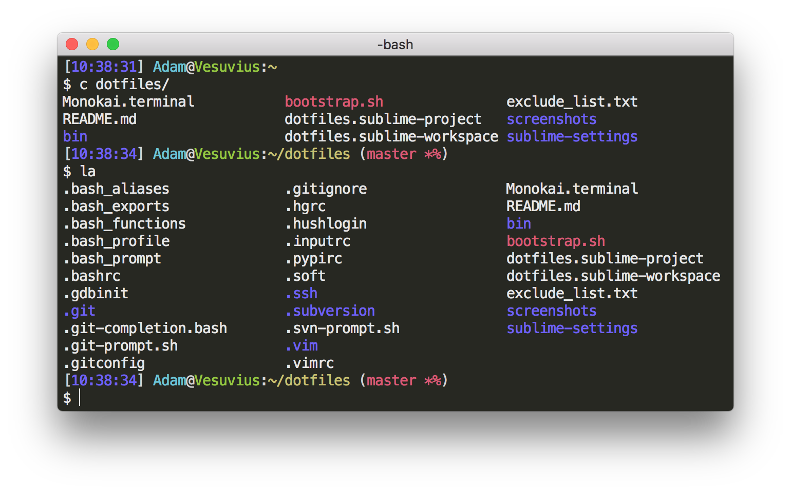
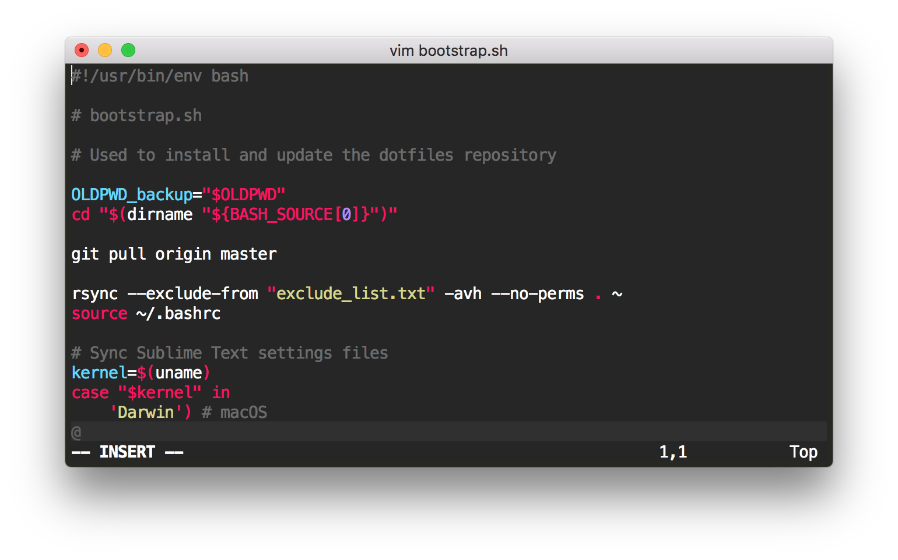

# dotfiles

My personal Linux and OS X configurations and settings

## Screenshots

### Terminal



The bash prompt displays the time, username, hostname, and working directory. If you are in a Git repository, it will also display the current branch. Yes, my computer is named after Mount Vesuvius. :)

### Vim



I chose a color scheme called Monokai, originally written by Wimer Hazenberg for [TextMate](https://macromates.com/), and [ported to Vim](https://github.com/sickill/vim-monokai) by [Marcin Kulik](http://ku1ik.com/). It is also the default color scheme in [Sublime Text](https://www.sublimetext.com/), my editor of choice.

## Installation

**Warning:** Installing my dotfiles will overwrite your old dotfiles. If you have any dotfiles in your home directory, back them up before doing anything else. That way you can revert to your old settings if you want to.

### Using Git and the bootstrap script

You can clone the repository wherever you want by running:

```bash
git clone https://github.com/adamjstewart/dotfiles.git
```

Then, all you have to do is source the bootstrap script:

```bash
cd dotfiles
source bootstrap.sh
```

By default, the script will prompt to make sure you don't accidentally overwrite any dotfiles in your home directory. If you want to skip the prompt, use the `-f` or `--force` option:

```bash
source bootstrap.sh -f
```

To update your local repository with any changes I've made, just source the bootstrap script again.

## Credits

* [Mathias Bynens](https://mathiasbynens.be) and his [dotfiles repository](https://github.com/mathiasbynens/dotfiles)
* [Marcin Kulik](http://ku1ik.com/) and his [vim monokai color scheme](https://github.com/sickill/vim-monokai)
* [Shawn Pearce](https://github.com/spearce) and his [git bash completion/prompt](https://github.com/git/git/tree/master/contrib/completion)

